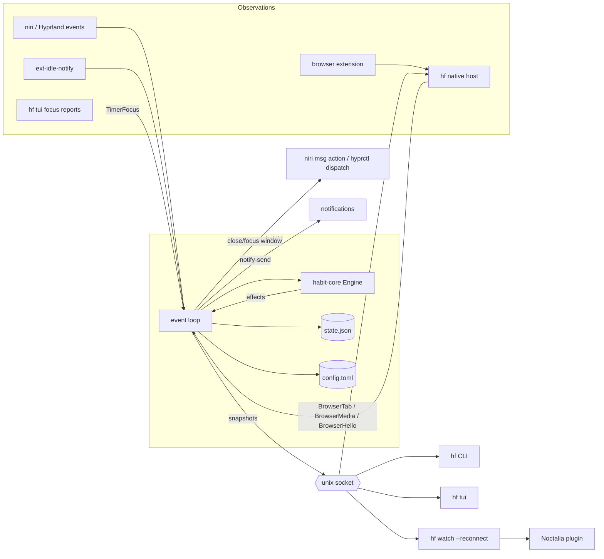

# habitfocus developer guide

How the project is built, how the pieces talk to each other, and how to develop, test and debug it. The
[README](../README.md) covers using the app; this document covers working on it.

- [Principles](#principles)
- [Repository layout](#repository-layout)
- [Architecture](#architecture)
- [habit-core: the engine](#habit-core-the-engine)
- [habit-ipc: the protocol](#habit-ipc-the-protocol)
- [habitd: the daemon](#habitd-the-daemon)
- [hf: CLI, TUI and native host](#hf-cli-tui-and-native-host)
- [Browser extension](#browser-extension)
- [Files on disk and environment variables](#files-on-disk-and-environment-variables)
- [Development setup](#development-setup)
- [Testing](#testing)
- [Releasing](#releasing)
- [Debugging](#debugging)
- [How to extend](#how-to-extend)
- [Pitfalls](#pitfalls)

## Principles

- **One brain, thin clients.** All rules live in `habit-core` and run inside `habitd`. The CLI, TUI, browser
  extension and shell plugins only display snapshots and send requests. A new shell integration never reimplements
  logic.
- **Pure core.** `habit-core` does no I/O and never reads the clock. The daemon feeds it observations (`Input`s) with
  the current time and carries out the actions it returns (`Effect`s). Everything time-dependent is unit-testable by
  passing timestamps.
- **Friction, not DRM.** The user owns the machine. Blocking, strict sessions and the commitment lock make giving in
  inconvenient and visible; they don't try to be unbreakable.
- **Compatible across versions.** Clients and a running daemon are often different builds (the daemon keeps running
  after `cargo install`). New snapshot and state fields use `#[serde(default)]`.

## Repository layout

```
Cargo.toml                    workspace: habit-core, habit-ipc, habitd, hf
crates/
  habit-core/                 pure logic, no I/O
    src/archive.rs            records for the archive database (visits, events, sessions)
    src/config.rs             config.toml schema, validation, window rules
    src/duration.rs           duration/time-of-day parsing and formatting
    src/engine.rs             Engine: inputs, commands, effects, snapshots
    src/lock.rs               commitment lock: weakening detection, config resolution, downtime check
    src/snapshot.rs           read-only views sent to clients (Snapshot, SessionView, LockView, DayView…)
    src/state.rs              persisted state (state.json): session, credits, unlocks, history, days, screen time, events, lock
    src/stats.rs              daily totals, streaks, civil dates
    tests/compat.rs           old daemons' snapshots and old state files still load
  habit-ipc/src/lib.rs        Request/Response types, paths, blocking client helpers
  habit-ipc/src/update.rs     latest GitHub release (through curl), version comparison
  habitd/src/
    main.rs                   Daemon struct, event loop, request handling, config/lock loading
    archive.rs                history.db: SQLite schema, import, writes and queries
    niri.rs                   niri event stream parser and window actions
    hyprland.rs               Hyprland event socket, window list and dispatchers
    idle.rs                   Wayland ext-idle-notify-v1 client (own thread)
    server.rs                 unix socket server (requests + subscriptions)
    procscan.rs               /proc scan to terminate blocked processes
    terminal.rs               the program in front in the focused terminal (/proc, tmux)
    update.rs                 daily release check, handed to the engine for snapshots
    settings.rs               editing [general] in config.toml with toml_edit
    config_edit.rs            reading and editing [groups.*] / [habits.*] entries for the TUI forms
    heartbeat.rs              boot id, CLOCK_MONOTONIC, shutdown detection
    sync/mod.rs               sync thread: account (sync.json), schedule, `sync_*` requests
    sync/run.rs               one sync: push this device's archive rows, pull the others'
    sync/api.rs               sync server HTTP API through curl
    sync/crypto.rs            end-to-end encryption of records (XChaCha20-Poly1305)
  hf/src/
    main.rs                   clap CLI, status/stats rendering, `watch --reconnect`
    native_host.rs            browser native messaging host + manifest installer
    setup.rs                  `hf setup`: config, systemd unit for the habitd next to hf, native host
    update.rs                 `hf update`: runs the newest release's install.sh for this prefix
    stats_view.rs             day grid and heatmap helpers shared by CLI and TUI
    web.rs                    `hf web`: HTTP server on 127.0.0.1, read-only API passed through to habitd
    web/index.html            the insights page (inline CSS/JS/SVG, compiled into hf)
    tui/mod.rs                terminal setup, event loop, snapshot stream, focus reporting
    tui/app.rs                TUI state machine and key handling (no terminal I/O)
    tui/ui.rs                 frame (header, sidebar/tabs, footer) and shared widgets
    tui/panes.rs              Today, Blocks, Habits, Insights and Lock panes
    tui/popup.rs              popups over any pane
    tui/editor.rs             block/habit form: fields, rows, keys (no terminal I/O)
    tui/form.rs               drawing of the form, TOML preview and app/site picker
extension/                    WebExtension (Firefox/Zen + Chrome/Brave/Helium), MV3
tests/extension/              headless browser end-to-end test for the extension
contrib/                      example config, systemd unit, extension packaging, install.sh,
                              release packaging (package-release.sh) and version check (check-version.sh)
.github/workflows/            ci.yml (tests, clippy), release.yml (binaries, extension, GitHub release)
docs/DEVELOPMENT.md           this file
```

## Architecture



Everything goes through `habitd`'s unix socket (`$XDG_RUNTIME_DIR/habitfocus.sock`). Each connection sends
JSON-lines requests; `subscribe` turns a connection into a stream of snapshots.

A typical flow, a user focusing their reading app:

1. niri emits `WindowFocusChanged` → `niri.rs` parses it into `Input::FocusChanged(Some(id))`.
2. The event loop calls `engine.handle(input, now)`.
3. The engine settles the session's time, sees the focused window matches the habit's `allow` rules and marks the
   session running (`running_since = Some(now)`). No effects.
4. The loop saves state if it's dirty and publishes a new snapshot to subscribers (the TUI, the plugin's
   `hf watch`, the extension's native host).

## habit-core: the engine

### Inputs, commands and effects

`Engine::handle(Input, now) -> Vec<Effect>` processes observations:

| Input | From | Meaning |
|---|---|---|
| `WindowsReset(list)` | niri `WindowsChanged` | full window list |
| `WindowChanged(w)` | niri `WindowOpenedOrChanged` | window opened, or its app id/title changed |
| `WindowClosed(id)` | niri | |
| `FocusChanged(id?)` | niri | `None` = nothing focused |
| `Idle(bool)` | idle thread | no keyboard/mouse input for `idle_timeout` |
| `TimerFocus { source, focused }` | `hf tui` | terminal focus for timer habits; `None` = client gone |
| `BrowserTab { source, window?, tab? }` | native host | active tab per browser window; `window: None` = host gone |
| `BrowserMedia { source, urls }` | native host | URLs of the tabs playing sound, focused or not; replaces the last report |
| `BrowserHello { source, pid }` | native host | extension alive inside browser process `pid` |
| `TerminalProgram { window, program?, tmux_session? }` | `terminal.rs` | program in front in a terminal window (`None` = only the shell) and the tmux session it shows |
| `Tick` | 1 s timer | expire unlocks, penalties, locks, saved progress, credit; schedule windows; browser guard; time accounting |

Commands are methods that return `Result<…, String>` (the error is shown to the user verbatim): `start`, `stop`,
`finish`, `continue_session`, `abort`, `log_done`, `unlock`, `relock`, `lock`, `request_lock_end`,
`cancel_lock_end`. `reload` (swap in a new config) and `apply_downtime` (lock tamper penalty) can't fail and return
effects directly.

Effects are what the daemon must do: `CloseWindow(id)`, `FocusWindow(id)`, `Notify { title, body }`,
`PlaySound(name)` (a timed habit reached its target; `habitd/src/sound.rs` resolves the name to a file and picks a
player), `ReloadConfig` (the commitment lock ended).

After every input and command the engine calls `update_session`, so session state is always consistent with the
latest observations. `take_dirty()` tells the daemon whether persistent state changed.

### Time and days

All times are unix milliseconds passed in by the caller. Local time comes from an injected
`with_local_offset(fn(utc_ms) -> offset_ms)` (the daemon uses chrono, tests use fixed offsets).

`day_of(now)` is the **logical day**: days since the epoch in local time, shifted by `general.day_start`. With
`day_start = "04:00"` a session at 00:30 belongs to the previous day. Saved progress, daily stats, streaks, screen
time and credit expiry all use logical days. Schedules use the calendar instead: `civil_day_of`, `time_of_day` and
`weekday_of` (Monday = 0). `day_start_ms` / `next_day_start` give the boundaries, and `clock_label(at, now)` renders
"22:00", "tomorrow 04:00" or "tue 04:00" for snapshots.

Snapshots carry **absolute** timestamps and pre-rendered labels, never countdowns that change every second: the daemon
only republishes when a snapshot changes (see [publishing](#event-loop)).

Debug builds of `habitd` shift their clock by `HABITFOCUS_NOW_OFFSET_MS` (release builds ignore it), to test day
boundaries and schedules without waiting.

### Sessions

`state.session` holds `accumulated_ms` plus `running_since` (not persisted: time while the daemon is down never
counts). Settling adds `now - running_since` to `accumulated_ms`. A session runs when:

- **apps habits:** the focused window matches an `allow` rule (app id, title regex, active tab URL regex and/or the
  terminal program and tmux session reported by `Input::TerminalProgram`) and the user isn't idle. An empty `allow` list means any activity counts.
- **timer habits:** a timer client (`hf tui`) reported focus within `TIMER_STALE_MS` (6 s). Idle is ignored. A client
  that goes silent only counts until `last report + TIMER_STALE_MS` (`timer_count_limit`).

`on_target = finish` completes the session at the target and grants the reward once. `ask` (the default for timers)
works in **rounds**: `update_session` banks the reward every time `accumulated_ms` passes another full target
(`bank_round`, which also counts a completion for streaks), sets `awaiting` and keeps counting. `continue_session`
only clears `awaiting`; `finish` is an alias of `stop`. Snapshots report the round-relative clock (`elapsed_ms`,
`target_ms`), plus `rounds_completed`, `banked_ms` and `total_elapsed_ms`.

`stop` saves the unfinished part of the current round (`accumulated_ms - rounds × target`) to
`state.progress[habit]` with the logical day; `start` resumes it on the same day (`resumed_ms`), so banked rounds are
never paid twice. Starting another habit stops the running one first. `abort` discards progress; strict sessions need
`emergency`, which sets `penalty_until` (unlocks refused).

Only **timed** habits (`apps`, `timer`; `HabitKind::is_timed`) have sessions. **Passive** habits have none:
`accrue_passive` (inside `accrue_usage`, so with the same idle and clamping rules) adds focus on a window matching
their `allow` rules to `days[today][habit].focused_ms`, saved on the screen-time cadence (`usage_dirty`).
`complete_passive`, after every input, completes one round per full `target` beyond today's `completions` (capped
by `rounds_per_day()`, default 1) with a notification, the sound and the reward when `has_reward()`; without a
target they're only tracked. `Reward::given` tells a written `reward` table from the default only passive habits may
omit. `HabitKind::tracks_time` covers all three kinds measured in time (progress, stats, `reward_rate`). `manual` and `counter` habits are logged
with `log_done(habit, amount, set, now)`: it adds to (or sets) `days[today][habit].count`, never below zero, and banks
one reward per full `goal` beyond today's `completions`, capped by `Habit::rounds_per_day()` (`daily_limit`, else 1
for manual and unlimited for counters). Lowering the count never lowers `completions`, so corrections can't take back
credit. `start` refuses logged habits and `log_done` refuses timed ones.

History entries (`state.history`, capped at 1000) record each sitting's own focused time
(`accumulated_ms - resumed_ms`), so sums across stopped and resumed sittings are correct.

### Blocking

- **Windows:** `enforce_window` closes windows whose app id is in a group that isn't unlocked. `closing` prevents
  repeated close effects while niri processes the first one.
- **Processes:** `is_process_blocked` feeds `procscan.rs` (daemon side, every 5 s).
- **Domains:** `blocked_domains` goes into every snapshot; the extension enforces it.
- **Strict focus:** `enforce_strict` refocuses the last allowed window (or any allowed one) when focus moves elsewhere,
  except to `strict_exempt_apps`. For timer habits the allowed window is `timer_window`, recorded when the TUI
  reports gaining focus.

`is_group_blocking(group, now)` (scheduled and not unlocked) is the single funnel every check above goes through,
including `GroupView.blocked`. Don't test schedules or unlocks separately elsewhere.

### Credit, unlocks and requirements

Credits (`state.credits`) are banked per group. `unlock` moves credit into `state.open_unlocks[group]`, an
`Unlock { mode, started_at, until, granted_ms, usage_left_ms }`. The mode is copied from the group at unlock time
(`UnlockMode` is ordered `Wallclock < Usage < RestOfDay`; the lock relies on that order):

- **wallclock:** open until `until`.
- **usage:** `usage_left_ms` is burned by `accrue_usage` only while `usage_burning`: a window or site of the group is
  focused and the user isn't idle, or a tab on one of its sites plays sound (`BrowserMedia`; a video in the
  background, on another monitor or watched without input). `until` is the next day start.
- **rest_of_day:** costs `rest_of_day_price`, open until the next day start.

`relock` refunds by mode (unused clock time, the usage budget left, nothing for a day pass). Unlocks warn
`expiry_warning` before ending and re-enforce all windows when they end. Old state files had
`unlocks: {group: until}`; `Engine::new` migrates them to wall-clock `open_unlocks`, and the old field is never
written again.

`unlock` is refused off schedule (nothing to unlock), during a penalty, and while `requirements_met(group)` is false:
the group's `requires` habits need ≥1 completion today, one of them (`require = "any"`) or all. An **immediate**
reward for a group that is still waiting is banked as credit instead (`grant_reward`), so it can't bypass the gate.

`expire_credit` (on `Tick`) clears all credit when the logical day changes and logs `credit_expired`.
`state.credit_day` is `None` in state files from before expiry existed; the first tick only records the day, so an
upgrade never loses credit.

### Schedules

`Group.schedule` (one `{days, ranges}` table or a list) compiles to a `WeekMask`: one bit per minute of the week.
`is_group_scheduled` looks up the current minute; with no schedule a group blocks always. A range ending before it
starts runs past midnight into the next day. `check_schedules` (on `Tick`) notices windows opening and closing,
logs `schedule_opened`/`schedule_closed`, closes windows that just became blocked, and warns before a window opens.
The first check after start or reload only seeds the state, so a restart doesn't announce every window.

### Screen time and the activity log

`accrue_usage(now)` runs at the start of every `handle()` and before unlock/relock/reload, attributing the time since
the last call to the focused window's app id, `site:<host>` for a browser window whose tab is known, or
`term:<program>` for a terminal (`general.terminals`) running a program (with `terminal_programs`). Steps are
clamped to `MAX_USAGE_STEP_MS` (5 s, so a suspend isn't counted) and skipped while idle. Totals go into
`state.app_days[day][key]`, pruned to `general.screen_time_days`. They're saved lazily: `take_usage_dirty` is separate
from `take_dirty`, the daemon saves them every 60 ticks and `flush_usage` on shutdown.

`state.events` is the activity log (capped at 500, newest last) and `events_seq` counts every event ever pushed, so
clients refetch only when it moves. The full log lives in the archive (below). `log_event` records; `log_and_notify` also emits a notification whose title comes
from `Engine::event_title(kind)`. `text` is rendered by the engine so every client shows the same wording.

### Archive and visits (`archive.rs`)

Data that only grows goes to the archive, `history.db` (SQLite) next to state.json, instead of state.json. The engine
does no I/O: `log_event`, `record_end` and `end_visit` queue `archive::Record`s (`Event`, `Session`, `Visit`), and
the daemon drains them with `take_archive()` after every loop iteration and on shutdown, writing each batch in one
transaction. The queue is capped at `archive::MAX_QUEUED`, so a daemon without an archive doesn't grow it forever.

A visit also records the habit whose session was counting at the time (`Visit::habit`), so screen time can read as
"Reading" instead of as the app; a session starting or ending splits the visit. `hour_breakdown(days, visits, now)`
turns visits into `HourSlice`s per local hour, labelled by habit, else category (`Config::app_category`), else the
app's display name, and
carrying the app key so a client can pick one app out of them. `day_breakdown` (one logical day, `offset` days back,
for `hour_stats`) and `period_breakdown` (with `app_stats`) wrap it — that's what the Insights chart stacks and
what stepping through days fetches.

**AFK** (`archive::Afk`): being away (`Engine::away`: idle, unless a timer habit is counting, since reading a paper
book next to `hf tui` needs no input) starts a stretch (`Engine::afk_since`, synced after every input by
`sync_afk`); coming back or `flush_usage` (shutdown) archives it with reason `idle`. While a timer counts through
idle, its visit continues and keeps the habit's label. It starts when idle is reported, so the `idle_timeout`
before it still counts as screen time and the stretch never overlaps a visit. A jump of at least `MIN_ASLEEP_MS`
(30 s) between two observations while not idle is a suspend, archived as `asleep`; the jump also ends the visit.

A **visit** is a stretch of focus on one screen-time key: `accrue_usage` extends `Engine::visit` while the same key
stays focused without a gap, and ends it on a key change (focus, tab), idle or a clamped jump. Visits under
`MIN_VISIT_MS` (1 s) are dropped. `app_insights(days, visits, now)` merges the archive's visits (plus the one in
progress) into `app_usage`: sessions (visits less than `SESSION_GAP_MS`, 60 s, apart are one), sessions today,
average and longest session, and use per local hour (each visit spread over the hours it covers). Totals still come
from `state.app_days`, which predates visits.

habitd side (`habitd/src/archive.rs`): `Archive::open` creates the schema (version in `PRAGMA user_version`; a newer
version refuses to open) and imports state.json's events and history into a new database. `events(limit)` serves the
`events` request (state.json's copy is the fallback), `visits(from, to)` the `app_stats` request (insights and the
hourly breakdown). Schema 2 added the visits' habit column, schema 3 the `afk` table; `migrate` changes the database in place. If the database
can't be opened habitd runs without it, logs why, and `app_stats` has no session or hour data.

Schema 4 prepares multi-device sync (see `docs/SYNC_CONCEPT.md` on the `concept/sync` branch). The `device` table
holds this installation's identity, a random UUID and the hostname, created once with the database; the UUID is the
device's `host` on the sync server. Every record table has `device` and `uid` columns: NULL for this device's rows,
the other device's id and the row's global uid (`<device>:<table>:<rowid there>`, unique) for rows pulled from it.
All queries for the engine and the views read `device IS NULL` only, so pulled rows change nothing until views ask
for them. For sync, `local_rows(table, after, limit)` reads this device's rows by rowid cursor with their uid,
`insert_remote(device, rows)` stores another device's rows (`INSERT OR IGNORE` on the uid, so pulling twice is
harmless), and `sync_state` / `devices` hold cursors and the account's other devices.

### Commitment lock (`lock.rs`)

`state.lock` stores `until`, the config text in force (`baseline`), `end_requested_at`, `pending` changes and
`extended_ms`.

- `weakenings(baseline, new)` lists every change that makes things easier. **Any new config field must be
  classified here** (see [How to extend](#how-to-extend)). Schedules are compared by blocked minutes (a coverage
  bitmap), not by fields; unlock modes by rank; a new timed habit only if it pays more per minute than the best
  existing one (`reward_rate` is `None` for logged habits), and a new logged habit always, since it's self-reported.
  An allow rule weakens unless it's `within` an old one (it has every condition of that rule, maybe more), and a new
  terminal in `general.terminals` weakens while `program` or `tmux_session` rules exist.
- `resolve_locked(baseline_text, file_text)` runs the file if it only tightens the baseline (it becomes the new
  baseline); otherwise it keeps the baseline and returns the pending list.
- `Lock::ends_at()` is `until`, or `end_requested_at + 24h` if earlier.
- `unexplained_downtime(heartbeat, boot_id, monotonic_now, grace)` returns downtime only for the same boot, not a
  clean shutdown, measured with CLOCK_MONOTONIC (which stops during suspend).
- **Browser guard** (`Engine::guard_browsers`, on `Tick`): during a lock, windows of `general.browsers` whose pid has
  no extension host that said hello in the last 60 s are closed after 30 s. The native host's parent pid is the
  browser process that owns the window.

### Stats and streaks (`stats.rs`)

`state.days[day][habit] = { focused_ms, completions, count }` is updated in `record_end`, `bank_round` and
`log_done`. It's uncapped (a few bytes per
habit per day) so long streaks stay correct. A streak counts days with ≥1 completion; the current streak counts back
from today, or from yesterday while today isn't done. `backfill_day_stats` builds `days` once from history for old
state files.

### Snapshots

`Engine::snapshot(now)` builds the complete client view: session, habits (with saved progress, streaks, today's
focus, counts and rounds), groups (schedule and unlock state, requirement progress), blocked domains, penalty, idle,
settings, lock, overall streak, `events_seq`, when credit expires, and the `[app_names]` and `[app_categories]`
labels, plus the built-in names (`term:nvim` is "Neovim") and automatic categories (Terminal, Browser) of every
screen-time key in use, so clients never resolve them. Snapshots are plain serde structs, so
every client (Rust, JS, Luau) reads the same JSON.

## habit-ipc: the protocol

JSON lines over a unix socket. Requests are tagged by `cmd` (snake_case):

| Request | Purpose |
|---|---|
| `status` | one snapshot |
| `subscribe` | stream of snapshots, one per line (see [publishing](#event-loop)) |
| `start {habit}` · `stop` · `finish` · `continue` · `abort {emergency}` | sessions |
| `done {habit, amount, set}` | log a manual/counter habit |
| `unlock {group, duration_ms?}` · `relock {group}` | credits and unlocks |
| `reload` · `set_setting {key, value}` | config |
| `set_app_name {app, name?}` · `set_app_category {app, category?}` | label a screen-time key in `[app_names]` / `[app_categories]` (null removes it) |
| `config_entries` · `edit_config {section, id, table?, create}` | blocks and habits of the config file as written / replace, create or (null table) delete one |
| `history {limit}` · `stats {days}` | history entries / daily totals |
| `events {limit}` · `app_stats {days}` | activity log from the archive (newest first) / screen time, sessions and hours per app |
| `hour_stats {day_offset}` | the hours of one logical day (0 = today), by habit, category and app |
| … `device` | on `app_stats`, `hour_stats`, `timeline`: a synced device's id or `all` (absent: this device) |
| `timeline {day_offset}` | every visit and AFK stretch of one logical day, labelled (`Response.timeline`), plus its hours (`breakdown`) |
| `lock {until_ms}` · `lock_end` · `lock_cancel_end` | commitment lock |
| `timer_focus {source, focused?}` | from `hf tui` |
| `browser_tab {source, window?, title?, url?}` · `browser_hello {source, pid}` | from the native host |

Each request (except `subscribe`) gets one
`Response { ok, error?, message?, snapshot?, history?, stats?, events?, app_stats?, config?, breakdown?, timeline? }`.

```sh
# Talk to the daemon by hand:
printf '{"cmd":"status"}\n' | socat - UNIX-CONNECT:$XDG_RUNTIME_DIR/habitfocus.sock | jq .snapshot.session
```

`habit-ipc` also owns path resolution (`config_path`, `state_path`, `socket_path`) and blocking helpers used by `hf`:
`request`, `subscribe`, `subscribe_stream`.

## habitd: the daemon

### Event loop

`main.rs` runs a single-threaded tokio runtime. `Daemon` owns the engine, the text of the config in force
(`config_text`) and file paths. One `select!` loop handles:

- **Tick (1 s):** `Input::Tick`, process scan every 5 ticks.
- **Events** from the mpsc channel: `Event::Input` (niri, idle) and `Event::Request` (socket connections, answered
  through a oneshot).
- **SIGTERM / SIGINT:** save a heartbeat (clean if the session or system is stopping) and exit.

After each iteration: save state if dirty (or every 30 s during a session, or a heartbeat every 10 s during a lock,
or every 60 ticks when only screen time changed), then publish a snapshot through a `watch` channel. Snapshots go out on every change and once per second while
something is time-sensitive (session, unlock, penalty, lock); unchanged snapshots (ignoring `now_ms`) aren't resent.

Effects are applied in `Daemon::apply`: niri actions and `notify-send` are spawned tasks; `ReloadConfig` reloads the
file synchronously.

### Config loading and the lock

`Daemon::start` and `Daemon::reload` choose the config:

- no active lock: parse the file (invalid config: error, keep running what was loaded);
- active lock: `resolve_locked(baseline, file)`, record `pending`, refuse the reload if anything weakens.

`set_setting` (and `edit_config`, via `config_edit.rs`, for whole blocks and habits) edits the file text with
`toml_edit` (comments and formatting survive), checks `weakenings` against the
baseline *before* writing, then writes atomically and reloads.

### Adapters

- **niri (`niri.rs`):** spawns `niri msg --json event-stream`, restarts it after 2 s if it exits, parses
  `WindowsChanged`, `WindowOpenedOrChanged`, `WindowClosed`, `WindowFocusChanged`. Actions run
  `niri msg action close-window|focus-window --id N`. Only enabled when `NIRI_SOCKET` is set.
- **Hyprland (`hyprland.rs`):** used when `NIRI_SOCKET` isn't set and `HYPRLAND_INSTANCE_SIGNATURE` is. Reads
  `.socket2.sock` in `$XDG_RUNTIME_DIR/hypr/<signature>` (or `/tmp/hypr`) and talks to `.socket.sock` directly, the
  way `hyprctl` does. Window ids are the window addresses, the app id is the `class`. The events leave out a new
  window's pid and class changes, so a `Tracker` keeps the window list and fetches `j/clients` again (sending only the
  differences) on `openwindow`, and on `activewindowv2` when the window is unknown or the `activewindow` event's class
  differs from the list. `windowtitlev2` updates titles, `closewindow` removes. Actions are dispatched as
  `hl.dsp.window.close|hl.dsp.focus({ window = "address:0x…" })` for a Lua config (Hyprland ≥ 0.56), or
  `closewindow|focuswindow address:0x…` for a classic one; whichever syntax worked is tried first from then on.
  `Daemon::compositor` picks the adapter once at start.
- **Terminal programs (`terminal.rs`):** `Watch::poll` runs after every loop iteration: while
  `Engine::focused_terminal()` is a terminal window (with `terminal_programs` or any `program`/`tmux_session` allow rule), every 2 ticks and right away when focus moves to another one, a
  blocking task reads `/proc` and sends `Input::TerminalProgram`. The shells are the terminal's descendants that lead a
  session on a tty; the foreground group (`tpgid` in `/proc/<pid>/stat`) names the program by `argv[0]` (interpreters
  by their script). A tmux client is followed with `tmux list-clients -F '#{client_pid} #{pane_pid} #{session_name}'`
  (using the client's `-L`/`-S`), which also names the session; for tmux in tmux the innermost session wins. Several shells in one terminal process (tabs) are told apart by the window title, then by the
  tty's access time.
- **Idle (`idle.rs`):** a std thread with its own Wayland connection binds `ext_idle_notifier_v1`; version 2's
  `get_input_idle_notification` ignores idle inhibitors (a playing video must not count as reading). `idle::Watch`
  creates a new notification (and thread) when `idle_timeout` changes; the old thread ignores its next event and
  stops.
- **Server (`server.rs`):** socket mode 0600, refuses to start if another daemon listens.
- **Heartbeat (`heartbeat.rs`):** `/proc/sys/kernel/random/boot_id`, `clock_gettime(CLOCK_MONOTONIC)` via libc, and
  `systemctl [--user] is-system-running == "stopping"` to recognize logout/shutdown.

### Sync (`sync/`)

Multi-device sync through a [habitfocus sync server](https://github.com/TheYoyoyfreak/habitfocus_sync_server), a fork
of Atuin's. It is opt-in: nothing happens until `hf sync register` or `hf sync login`.

- **Thread:** `sync::spawn` runs a std thread with its own `Archive` connection (WAL; both connections have a 5 s busy
  timeout), so a slow server never holds up the event loop. It syncs 30 s after start, then every 10 minutes, and
  stops after the server says the session is gone (the device was signed out). The event loop hands it every
  request where `Request::is_sync()`, with the reply channel; it answers when done.
- **Account:** `sync.json` next to state.json (mode 0600, written atomically): server, username, the device's session
  token and the sync key. Signing out removes it and clears `sync_state` and `devices`; pulled rows stay.
- **Records:** every archive table is one log per device on the server (tag = table name, host = the archive's device
  id). A record holds up to 500 rows or 512 KiB of JSON, `{"rows": [[rowid, row], …]}`, rows as they serialize in
  habit-core. Pulled rows get the uid `<device>:<table>:<rowid>`.
- **Cursors** (`run.rs`): `push:<table>` is `<next idx>:<last rowid sent>`, `pull:<device>:<table>` the next idx to
  fetch. Before pushing, the server's last idx of this device's log is compared with the local one; when they differ
  (crash after an upload, signing in again, a deleted store) the cursor is taken from the server's last record, so
  rows are never skipped or sent twice under a new idx.
- **Encryption** (`crypto.rs`): one random 256-bit key per account, shown at registration as `hfk1-…` and entered on
  every other device. Records are sealed with XChaCha20-Poly1305 under a random nonce; the record's id, idx, host,
  tag and version are the associated data, so the server can't move a record unnoticed. `cek` carries a key id, which
  tells a wrong key apart from a damaged record; `login` checks the key against the account's first record and signs
  the device out again if it doesn't fit.
- **HTTP** (`api.rs`): through `curl` like the update check. The request (URL, token, body) goes to curl as a config on
  stdin, never on its command line. `run.rs` uses the `Api` trait, which the tests implement with an in-memory server.
- **Forward compatibility:** rows that don't parse (an event kind from a newer habitfocus) are skipped; tables this
  version doesn't know are left on the server.

- **Status:** the thread sends `Event::SyncChanged(Option<SyncView>)` to the event loop whenever something changes
  (sign in or out, a sync starting or ending, the server going away or coming back); `Engine::set_sync` puts it in
  snapshots as `snapshot.sync`, `None` while not signed in. Between syncs it asks `GET /healthz` every minute;
  `reachable` is false after a request that got no answer (`ApiError::Unreachable`).

**Views across devices.** `app_stats`, `hour_stats` and `timeline` take an optional `device`: absent (or this
device's id) is this device as before, `"all"` (`habit_ipc::ALL_DEVICES`) every device, any other id that device.
habitd turns it into `archive::Devices` for the queries (`visits_of`, `afk_of`, `first_visit_of`) and a
`UsageSource` for the engine's `*_for` functions:

- `Local`: totals from `state.app_days`, plus the visit in progress (unchanged).
- `Remote`: everything from that device's visits (`Engine::visit_usage` spreads each visit's active time over the
  logical days it covers, by this device's `day_start`); no visit in progress, its own AFK.
- `Combined`: everything from all devices' visits plus the visit in progress, and `Response.wall_clock`
  (`Engine::wall_clock`): the union of all visits' wall time, so overlapping devices count once. The timeline has
  no AFK here (away from one device isn't away from all).

The visits of other devices only exist since they started syncing; this device's screen-time days go further back
than its visits, so "this device" and "all devices" can differ before that. Habits, streaks and the log are still
this device's.

## hf: CLI, TUI and native host

### CLI (`main.rs`)

clap subcommands map almost 1:1 to requests. Rendering helpers (`render`, `render_lock`, `render_stats`,
`waybar_json`) turn snapshots into text. `hf watch --json --reconnect` never exits: it prints snapshots, prints
`{"connected":false}` while the daemon is unreachable and `{"connected":true}` every 10 s as a heartbeat (read timeout
on the socket, keeping partial lines). Shell plugins run it once.

### TUI (`tui/`)

- `app.rs`: `App` holds the latest snapshot, the log, daily stats, screen time, the pane (`Today`, `Blocks`,
  `Habits`, `Insights`, `Lock`), a habit and a group selection, popup and flash message. `handle_key` returns an
  `Action` (`None`, `Quit`, `Send(Request)`): global keys first, then the pane's (`handle_habit_key`,
  `handle_block_key`, `handle_lock_key`). No terminal I/O, so key handling is unit-tested directly. Popups:
  `Unlock`, `ConfirmAbort`, `GoalReached` (opens by itself), `Settings`, `Lock` (duration to commit or extend),
  `Count` (amount to log); text prompts share `handle_input_key`.
- `ui.rs`: the frame (header, sidebar from 100 columns or a tab bar, per-pane footer hints) and shared widgets:
  the session box, `habit_progress`, `group_state`, bars. `panes.rs` draws the five panes, `popup.rs` the popups.
- Insights rows come from `stats_view::usage_rows` (shared with `hf apps`): filtered by `App::insights_filter`
  (id, name or category) and grouped per category with `App::by_category`; `app_index` 0 is their total. While
  `App::filtering`, keys go to the filter before any global key.
- `editor.rs` / `form.rs`: the block and habit form. `Action::OpenEditor` makes `mod.rs` fetch `config_entries` and
  call `App::open_editor`; the form edits the entry's JSON table (values as written, durations as strings) through
  a static field list (`BLOCK_FIELDS`, `HABIT_FIELDS`, with dotted paths like `reward.duration`) and saves with
  `edit_config`. `App::apply_response` closes a saving form on success and shows habitd's error in it otherwise.
  Habit fields follow the kind (`applies`); switching kinds restores what the entry had when opened. Allow rules
  (`Kind::Rules`) are tables: the picker suggests recent screen-time keys and `Context::tmux_sessions` (listed by
  `mod.rs` when the form opens) as text, and `rule_from_text` turns text into a rule (`site:` becomes a `url` regex
  that `site_of_pattern` shows as the site again).
  Tests render into ratatui's `TestBackend` and assert on the text.
- `mod.rs`: enables focus-change reporting, streams snapshots on a thread (reconnecting), refetches the log, stats
  and screen time when `events_seq` moves, after actions and every 30 s, and runs `FocusReporter`. `FocusState::due` decides when to send `timer_focus`: on every change and
  every 2 s while focused; settings open counts as unfocused. Inside tmux without `focus-events on`, focus reporting
  is disabled and the TUI shows a warning (otherwise the timer would count while the user is elsewhere).

### Web page (`web.rs`, `web/index.html`)

`hf web` is one more client: a `std::net` HTTP server (no dependencies, one thread per connection, GET only,
`Connection: close`) bound to 127.0.0.1. `/` serves `web/index.html`, compiled in with `include_str!`; `/api/<cmd>`
maps the query to a `Request` in `api_request` and returns habitd's `Response` as JSON (503 when habitd is
unreachable). `api_request` is a **whitelist of requests that only read**; that's what keeps the page read-only, so
never add one that changes state. Requests whose `Host` isn't the page's own address are refused, against DNS
rebinding.

The page is plain JS without a build step or CDN: it polls `status` every 10 s and refetches the view when
`events_seq` moves (or every minute for today). Charts are SVG drawn at their measured width (`chart()`); colors
are a fixed categorical order assigned by use, the rest folded into "Other". The view is in the URL hash
(`#timeline`, `#screen`, `#habits`, `#log`). The timeline comes from the `timeline` request
(`Engine::day_timeline`: the archive's visits and AFK stretches plus the ones in progress, cut to the logical day
and labelled).

### Native host (`native_host.rs`)

Browsers start `hf` directly with their own arguments (Chrome: `chrome-extension://ID/`; Firefox: the manifest path
and extension id). `main` detects that before clap parsing. The host:

- reads/writes length-prefixed JSON (native byte order) on stdio;
- streams snapshots to the extension (`{type:"snapshot"}` / `{type:"disconnected"}`);
- forwards `tab` / `window_closed` as `browser_tab` requests;
- sends `browser_hello` with its parent pid every 20 s;
- forwards blocked-page requests, allowing only `status`, `start`, `unlock`, `relock` (not `done`: logging is
  self-reported, and a web page must not be able to do it);
- clears its tabs when the browser closes stdin.

`hf install-native-host` writes `dev.habitfocus.host.json` into `~/.mozilla/native-messaging-hosts` (always, Zen
reads it too), the directories of Firefox forks that exist (`~/.zen`, `~/.librewolf`, …) and those of installed
Chromium browsers (`~/.config/<browser>/NativeMessagingHosts`), pointing at the canonical path of the running `hf`.

## Browser extension

MV3, one codebase for Firefox-family and Chromium browsers (the manifest has both `background.scripts` and
`service_worker`; each browser uses the one it supports).

- `background.js` connects to the native host, keeps the latest snapshot and `blocked_domains`, and reconnects every
  5 s. Blocking uses `webNavigation.onBeforeNavigate` + `tabs.update` to `blocked.html?url=…` (identical in all
  browsers, no host permissions). It **fails closed**: the last snapshot is cached in `storage.local`.
- Work per snapshot is kept small: tabs are rescanned and storage written only when the blocked set changes;
  discarded tabs are skipped (they're caught when they load); a tab isn't redirected twice within 2 s.
- `blocked.html/js` renders progress, credits, the required habits with their progress and unlock buttons for the
  group's unlock mode (disabled while it waits for habits) from state pushed over a runtime port. After an unlock it
  calls `location.replace(original)` **once**: repeated calls cancel the in-flight navigation, which used to loop
  forever on slow sites.
- Tab reporting (`tab` messages) feeds `url` allow rules; the engine links tabs to niri windows by title prefix.
- The fixed Chrome extension id (`llodhgcgpbcebpccjlllfnbbdcibedpb`) comes from the public `key` in `manifest.json`;
  the Firefox id is `habitfocus@habitfocus.dev`. Both are hardcoded in `native_host.rs`.
- `contrib/package-extension.sh` builds `dist/habitfocus.xpi`.

## Files on disk and environment variables

| Path | Content |
|---|---|
| `~/.config/habitfocus/config.toml` | user config (`hf init` writes `contrib/config.example.toml`) |
| `~/.local/state/habitfocus/state.json` | persisted `State` (written atomically via `.tmp` + rename) |
| `~/.local/state/habitfocus/history.db` | archive: events, sessions, visits, afk, and this device's sync identity (SQLite, WAL mode; `hf paths` prints it) |
| `~/.local/state/habitfocus/sync.json` | sync account: server, user, session token, sync key (mode 0600; only after `hf sync register`/`login`) |
| `$XDG_RUNTIME_DIR/habitfocus.sock` | daemon socket |
| `~/.config/systemd/user/habitd.service` | from `contrib/habitd.service` |
| `~/.mozilla/native-messaging-hosts/dev.habitfocus.host.json` (and `~/.zen`, Chromium dirs) | native host manifests |

| Variable | Effect |
|---|---|
| `HABITFOCUS_CONFIG` | config file path |
| `HABITFOCUS_SOCKET` | socket path (daemon and clients) |
| `XDG_CONFIG_HOME`, `XDG_STATE_HOME`, `XDG_RUNTIME_DIR` | standard base directories |
| `HABITFOCUS_TAMPER_GRACE_MS` | downtime grace for the lock (default 60000; for tests) |
| `HABITFOCUS_NOW_OFFSET_MS` | debug builds only: shift the daemon's clock (schedules, day boundaries) |
| `NIRI_SOCKET` | enables the niri adapter (unset it to run a daemon that doesn't touch your windows) |
| `HYPRLAND_INSTANCE_SIGNATURE` | enables the Hyprland adapter when `NIRI_SOCKET` isn't set (unset both for a daemon that leaves windows alone) |
| `HABITFOCUS_NO_SYSTEMCTL` | `hf setup` (and `install.sh`) print the `systemctl --user` calls instead of running them |
| `HABITFOCUS_REPO` | `owner/name` the release check, `hf update` and `install.sh` use (a fork, or testing against a repository with releases) |

## Development setup

Requirements: Rust (edition 2021, developed with 1.92), a Wayland session (niri or Hyprland for window features), `notify-send`.
For the extension test: Node ≥ 22 (built-in `WebSocket`), Python 3, a Firefox-based browser. `tmux` is handy for TUI
testing.

```sh
cargo build                      # all crates
cargo test                       # unit tests (core, daemon, CLI/TUI)
cargo clippy --all-targets       # keep it warning-free
cargo test -p habit-core lock    # one crate, filtered
tests/extension/run.sh           # extension e2e (see Testing)
```

### Install your build

```sh
cargo install --path crates/habitd && cargo install --path crates/hf
systemctl --user restart habitd      # the running daemon keeps the old binary until restarted
hf install-native-host               # only needed once, or after moving hf
contrib/package-extension.sh         # then reinstall dist/habitfocus.xpi in the browser
```

A running native host is also an old `hf` process; the browser restarts it when the extension reconnects (reload the
extension, or kill the `hf …habitfocus.host.json` process).

### Run an isolated daemon

Never experiment on your real state. Point everything at a temp dir; keep the socket path short (unix socket paths
are limited to ~108 bytes):

```sh
W=$(mktemp -d /tmp/hf.XXXX)
cp contrib/config.example.toml $W/config.toml      # or a minimal config
export HABITFOCUS_CONFIG=$W/config.toml HABITFOCUS_SOCKET=$W/hf.sock XDG_STATE_HOME=$W/state
env -u NIRI_SOCKET -u HYPRLAND_INSTANCE_SIGNATURE ./target/debug/habitd &   # no window closing/refocusing
./target/debug/hf status
./target/debug/hf tui
```

Keep `NIRI_SOCKET` (or `HYPRLAND_INSTANCE_SIGNATURE`) only when you want to test window features, and make sure the test config doesn't block apps you
have open. A throwaway window with a fake app id works well: `kitty --class hf-test sleep 300`.

## Testing

### Unit tests

- **Engine** (`engine.rs` tests): build an `Engine` from a TOML string, feed inputs with explicit timestamps, assert
  on effects, state and snapshots. Timer habits need focus heartbeats every 2 s (use the `heartbeat` helper): a
  single report goes stale after 6 s, exactly like in production.
- **Lock** (`lock.rs`): string-replace a base config and assert `weakenings` finds each change; downtime cases.
- **Stats** (`stats.rs`): streak edge cases, civil dates.
- **Daemon** (`habitd`): niri event parsing, settings editing, the archive (in-memory SQLite).
- **TUI**: `app.rs` tests drive keys and assert `Action`s; `ui.rs` tests render to `TestBackend` and search the
  screen text. Mind double-width characters (emoji) in assertions.
- **Compat** (`habit-core/tests/compat.rs`): snapshots from older daemons still parse, unknown habit kinds from newer
  ones parse as `Other`, and a `state.json` from before unlock modes loads with its unlock intact.

### Extension end-to-end

`tests/extension/run.sh` builds the workspace, starts an isolated daemon with a throwaway `HOME` (so the native host
manifest points at the build), a Python server that answers after 2 s (`blocked.test` mapped to localhost via
`network.dns.localDomains`), and a headless browser with WebDriver BiDi. `harness.mjs` installs the extension and
checks: blocking, no navigation churn during a session, the required-habit gate (unlock disabled until
`hf done walk`), unlock returns to a slow site, relock blocks an open tab.

```sh
tests/extension/run.sh                               # Zen or Firefox, whichever is found first
BROWSER=/usr/bin/firefox tests/extension/run.sh
EXTENSION=/path/to/other/extension tests/extension/run.sh   # e.g. to confirm a regression on an old version
```

### Live testing recipes

- **TUI in tmux**, isolated from your own tmux server:
  ```sh
  tmux -L hftest -f /dev/null new-session -d -s t -x 110 -y 42
  tmux -L hftest set -g focus-events on
  tmux -L hftest send-keys -t t ". $W/env.sh && hf tui" Enter
  tmux -L hftest send-keys -t t -l $'\e[O'     # simulate terminal focus lost ($'\e[I' = gained)
  tmux -L hftest capture-pane -p -t t          # read the screen
  ```
  Wait until the screen shows `connected` before sending keys.
- **Schedules and day boundaries:** give the test config a window starting a minute from now (or run a debug
  daemon with `HABITFOCUS_NOW_OFFSET_MS`) and watch `hf status` and `hf events` flip. For windows, keep
  `NIRI_SOCKET` and open `kitty --class hf-test`.
- **Logged habits and gates:** `hf done <habit> [n]` against a config with `requires`, then `hf unlock`.
- **Lock tampering:** `HABITFOCUS_TAMPER_GRACE_MS=2000`, lock, wait for a heartbeat (10 s), `kill -9` the daemon,
  wait, restart; `hf lock status` shows the extension.
- **Browser guard:** `browsers = ["hf-fakebrowser"]`, open `kitty --class hf-fakebrowser`, send
  `{"cmd":"browser_hello","source":"t","pid":<kitty pid>}` to the socket to keep it alive.

## Releasing

Releases are built by `.github/workflows/release.yml` when a `v*` tag is pushed:

1. Bump the version everywhere `contrib/check-version.sh` looks: `Cargo.toml` (`[workspace.package]`, then
   `cargo build` to update `Cargo.lock`) and `extension/manifest.json`. Commit.
2. `git tag v0.2.0 && git push origin v0.2.0`.

The workflow checks the versions, builds static binaries for `x86_64-` and `aarch64-unknown-linux-musl` with
`cargo zigbuild` (zig links musl and compiles the bundled SQLite), packages them with `contrib/package-release.sh`
into `habitfocus-<arch>-linux.tar.gz`, signs the extension as *unlisted* on addons.mozilla.org
(`web-ext sign`, secrets `AMO_JWT_ISSUER` / `AMO_JWT_SECRET` from an AMO account's API keys), zips it for Chromium,
writes `updates.json` (the extension's `update_url`) and `SHA256SUMS`, and publishes the release with
`install.sh`. Asset names carry no version, so `releases/latest/download/<asset>` always points at the newest.

A tag with a suffix (`v0.2.0-rc.1`) makes a pre-release: `/releases/latest` skips it, so install.sh and
`hf update` ignore it, and its extension isn't signed (AMO signs a version once, and Firefox versions can't have
the suffix; the extension carries `0.2.0`). Try one with `sh install.sh --version v0.2.0-rc.1`.

Installer and update without a release: `contrib/package-release.sh x86_64-unknown-linux-musl target/release`
packages a local build, and
`HOME=$(mktemp -d) HABITFOCUS_NO_SYSTEMCTL=1 sh contrib/install.sh --from dist/habitfocus-x86_64-linux.tar.gz`
installs it into a throwaway home (again for the update path, `--uninstall` to remove).

## Debugging

| Symptom | Look at |
|---|---|
| `hf: invalid response from habitd` | daemon older than `hf`: `systemctl --user restart habitd` |
| daemon messages | `journalctl --user -u habitd -f` |
| extension | `about:debugging` → Inspect (Firefox/Zen), `chrome://extensions` → service worker (Chrome) |
| native host not connecting | `pgrep -af habitfocus.host`, manifest path in `~/.mozilla/native-messaging-hosts/` |
| raw daemon state | `hf status --json`, `~/.local/state/habitfocus/state.json` |
| archive | `sqlite3 ~/.local/state/habitfocus/history.db 'SELECT key, count(*), sum(active_ms)/60000 FROM visits GROUP BY key'` |
| window ids / app ids | `niri msg windows`, `niri msg --json event-stream`; `hyprctl clients`, `socat -u UNIX-CONNECT:$XDG_RUNTIME_DIR/hypr/$HYPRLAND_INSTANCE_SIGNATURE/.socket2.sock -` |

## How to extend

### Add a request

1. Add the variant to `Request` in `habit-ipc` (it's serialized as `{"cmd":"snake_case"}`).
2. Implement the logic in `Engine` (returning `Result<_, String>` with user-facing errors) and add tests.
3. Handle it in `Daemon::handle_request`.
4. Expose it: `hf` subcommand, TUI key/popup, plugin button or `onIpc`, and the native host allowlist if the blocked
   page needs it.

### Add a snapshot or state field

Add it with `#[serde(default)]` (and `Default` for structs) so older daemons, newer clients and old `state.json`
files keep working. Extend `tests/compat.rs` if the field matters to clients.

### Add a config field

1. Add it to the struct in `config.rs` (`deny_unknown_fields` rejects typos, so users get clear errors).
2. **Classify it in `lock::weakenings`**: if changing it can make things easier, the commitment lock must hold it
   back. Add a case to `detects_each_kind_of_weakening`.
3. If it belongs in the settings menu: `settings::EDITABLE`, `SettingsView`, `tui/app.rs` `SETTINGS`. If it's a
   block or habit field worth editing in the TUI, add a `Field` to `BLOCK_FIELDS` / `HABIT_FIELDS` in
   `tui/editor.rs` (and to `applies` if it depends on the habit kind). Nothing else: habitd validates the edit and
   checks it against the lock like any config change.
4. Document it in `contrib/config.example.toml`.

### Add a compositor

Mirror `niri.rs` or `hyprland.rs`: a module that turns the compositor's event stream into `Input::WindowsReset`,
`WindowChanged`, `WindowClosed` and `FocusChanged` (with the window's pid for the browser guard), plus close/focus
actions. Then add a variant to `Compositor` in `main.rs`, detected from the compositor's environment variable, and
route its `spawn_events`, `close_window` and `focus_window`. The engine needs no changes.

### Add a shell integration

Run `hf watch --json --reconnect` and parse lines: objects with `now_ms` are snapshots, `{"connected": bool}` is
connection state. Send commands by running `hf <subcommand>`. For simple bars, `hf status --waybar` may be enough.

## Pitfalls

- **Version skew:** `cargo install` doesn't restart the daemon or a running native host.
- **Socket path length:** deep temp dirs make `bind` fail with `path must be shorter than SUN_LEN`.
- **tmux focus events** are off by default; timer habits depend on them.
- **Extension navigation:** never call `location.replace`/`tabs.update` repeatedly for the same tab; it cancels the
  navigation in progress.
- **Test pages** in the extension e2e need a `text/html` content type, or the browser treats them as downloads.
- **Firefox ≥ 155 BiDi** needs `-remote-allow-system-access` to evaluate scripts in extension pages.
- **Noctalia `runStream`** has no close callback; that's why `hf watch --reconnect` never exits and sends heartbeats.
- **Double-width characters** (emoji) shift ratatui cells; the TUI avoids them.
- **Lock and config fields:** a new config field that isn't classified in `weakenings` is a loophole in the
  commitment lock.
- **Stale binaries:** `cargo test` and `cargo clippy` don't rebuild `target/debug/habitd`; run `cargo build` before
  live tests, or an old daemon rejects new config fields ("unknown field").
- **Live countdowns in snapshots** would force a publish every second; send absolute times and labels instead.
- **`HabitKind` matches:** clients see `Other` for kinds from newer daemons; keep a `_` arm.
